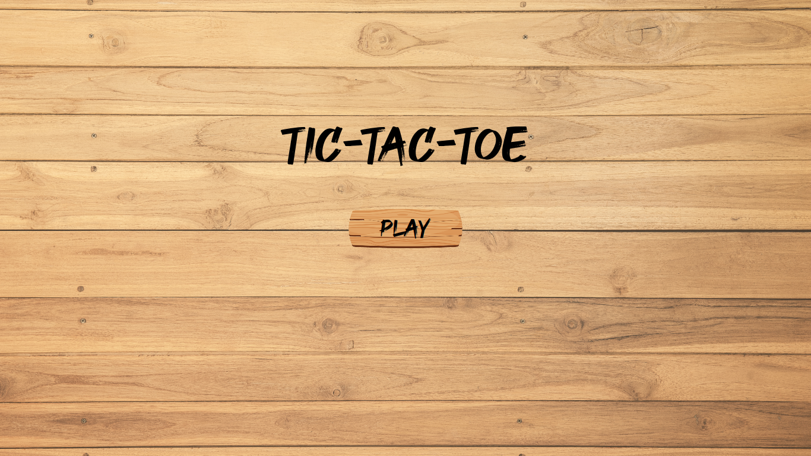
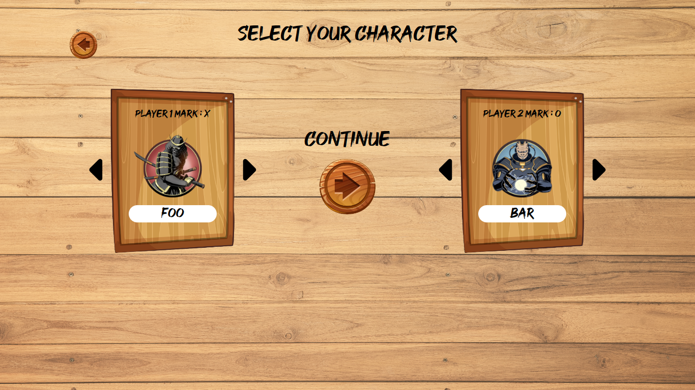
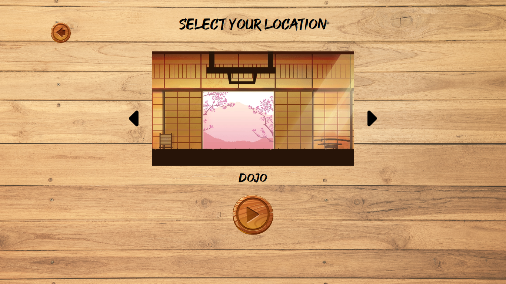
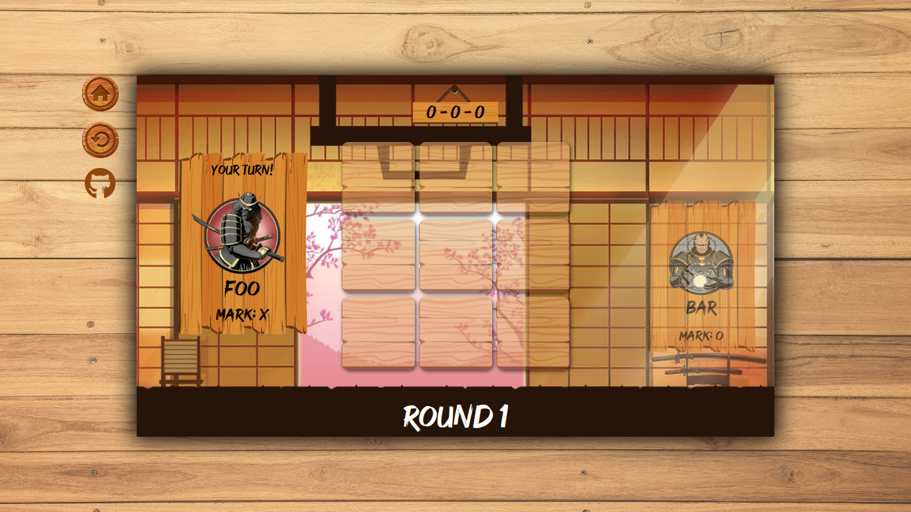
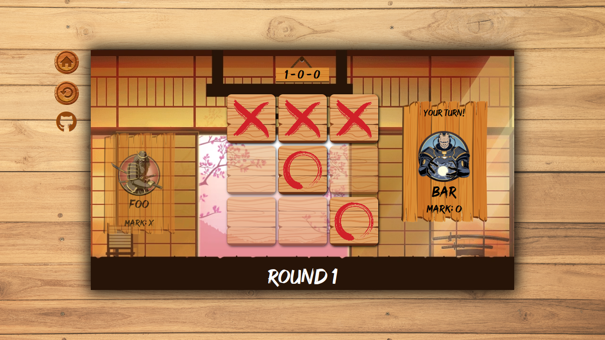
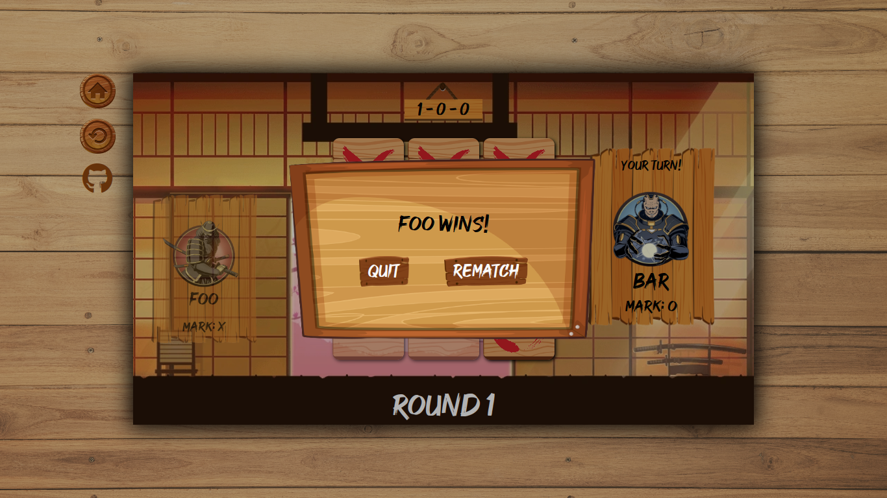

<h1 align="center">Tic Tac Toe</h1>
<h3 align="center"><a href="https://gaaabbb.github.io/tic-tac-toe/">:film_projector: Live Demo</a></h3>

## :scroll: Description
This project, which was created as part of TheOdinProject's JavaScript Course, is a Tic Tac Toe game where two players take turns marking the spaces in a three-by-three grid and whoever successfully makes a diagonal, horizontal, or vertical row will be declared the winner. The visual design of this project is heavily based on the mobile game "Shadow Fight 2."

## :pencil2: Features
* A fully functional Tic Tac Toe game.
* Gives player an option to have a rematch or to return to title screen after the game is over.
* Displays the scores of the players.
* A restart button to restart the whole game.
* Allows players to choose their character.
* Allows players to choose the location, where the game will take place.
* Responsive design and works well in mobile.

## :framed_picture: Gallery
#### Title Screen

#### Character Selection

#### Location Selection

#### Game Board

#### Gameplay

#### Winner

## :computer: Languages Used
* HTML
* CSS
* JavaScript

## :copyright: Credits
### Font
* DaFont - Good Brush by Sarah Robbaniyyah
### Pictures
* FreePik: @grelectric, @upklyak, @pch.vector, @brgfx, @fwstudio
* VectorStock: @reniutami
* [Shadow Fight 2 Fandom](https://shadowfight.fandom.com/)
### Note
*I don't own any of the the pictures and fonts used in this website. The rights for the materials I used belong to the respective authors, aritsts, and game publishers.*

## :left_speech_bubble: Reflection
There are a lot of new knowledges and experiences that I gained in making this project, such as factory functions, public and private variables and functions, IIFE, and modules. I also got to learn about an important concept called closure and gained a deeper understanding of how scopes work in JavaScript. Besides learning new concepts, I also got to improve my CSS skills and organize my program properly as well. This project proved to be difficult for me because I had a hard time grasping the idea of how factory functions and modules work, and as a result, I went through lots of fruitless solutions, overwhelming experiences, and constant failures, which is why I took a long time completing this project. However, I wouldn't let that bother me because I know that these experiences will serve as a stepping stone for me to improve my skills. Overall, I'm proud of this project and I'm very happy with the outcome as well.